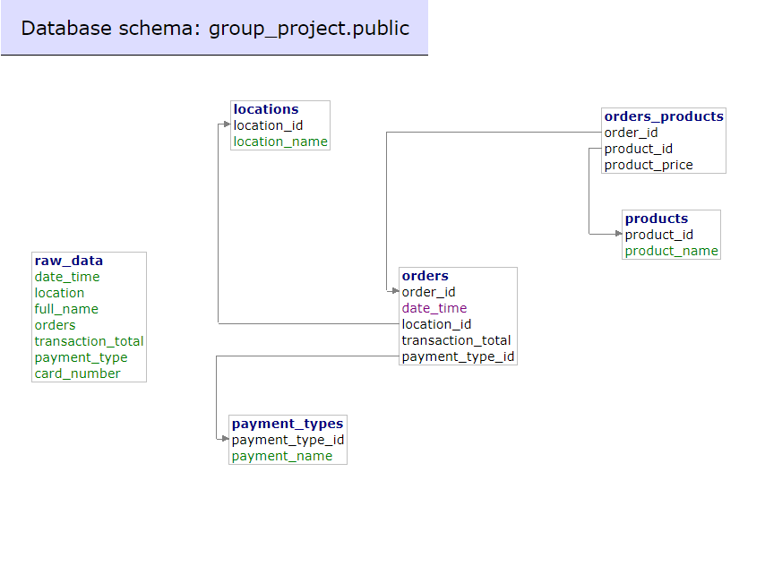

# 🅱🆁🅴🆆🅴🅳 🅰🆆🅰🅺🅴🅽🅸🅽🅶

<p align="center"></p>

## Description 

Introducing the Brewed-Awakening Project - an innovative solution that will revolutionize the way Super-Cafe manages its sales data.

As Super-Cafe continues to expand across the country, their sales data has been increasing exponentially, leading to an urgent need for an efficient and effective data management system. The current system of using Comma Separated Values format for tracking data has become outdated and unreliable, leading to a lot of manual work and errors.

With the Brewed-Awakening Project, our team will be creating a state-of-the-art software solution that will meet all of Super-Cafe's data management needs. We aim to deliver a fully functional product by the end of Week 5 that will be ready for testing. Our software will feature core functionality that will help Super-Cafe expertly and efficiently organize its data, leading to improved sales in the long run.

During Week 6, we will focus on refining and polishing the code while adding any new non-essential functions. Our ultimate goal is to provide Super-Cafe with a comprehensive solution that is easy to use and maintain, so they can focus on growing their business domestically and internationally. With our software in place, Super-Cafe will have a competitive edge over its competitors, allowing it to dominate the market and become a leader in the industry.


## Elevator Pitch

**FOR:** SUPER-CAFE COFFEE SHOP<br />
**WHO:** Wants to organise their sales data from multiple branches<br />
**THE:** Brewed Awakening Project<br />
**IS A:** ETL (Export, Transform, Load) Application<br />
**THAT:** Performs and allows Super-Cafe to analyse, organise and take control of their data through pipeline cleansing and visualisation.<br />
**UNLIKE:** Their old system of using CSVs<br />
**OUR PRODUCT:** Will allow them to make sense of their data and spot trends more efficiently as well as solves the problem of data inconsistencies and inaccuracies.<br />

## Built With

The Brewed Awakening project was built using a combination of technologies, including:
* Python 3
* Jupyter Notebook for individual function testing 
* AWS Lambda for severless computing
* PostgreSQL for the local test Database
* CloudWatch Metrics and logs were collected from multiple sources including AWS S3 buckets. 
* Grafana for data visualisation.

### **Database Schema**

<p align="center"></p>

### **Cloud Architecture**

<p align="center"></p>

### Visualisation Results with Grafana

Below are a few screenshots of the type of dashboards we were able to achieve with the data in our redshift database, as well as CloudWatch logs:

1. This Dashboard Monitors our Database:
<p align="center"></p>

2. This Dashboard Monitors the Sales Data
<p align="center"></p>

3. This Dashboard Monitors the ETL Pipeline
<p align="center"></p>

## Installation Instructions

This section is a step-by-step guide on how to install and set up the main platforms used for the project.

* Install Python 3 on VS Code. This can be downloaded from the official website [here](https://www.python.org/downloads/) and follow the installation instructions. Once Python 3 is installed, make sure it's added to the system's PATH environment variable.

* Install Docker on your local machine. This can be downloaded from the official website [here](https://www.docker.com//) and follow the installation instructions.

* Set up AWS. We will create an AWS account and set up an S3 bucket to store the project files. Follow the AWS documentation to create an S3 bucket and obtain an access key ID and secret access key.

* Set up Grafana. We'll need to download and install Grafana on our local machine. Once Grafana is installed, open a browser and navigate to http://localhost:3000 to access the Grafana dashboard. Log in with the default username and password (admin/admin).

* Clone the project repository [here](https://github.com/generation-de-lon9/brewed-awakening-final-project). Use Git to clone ```git clone git@github.com:generation-de-lon9/brewed-awakening-final-project.git ``` the project repository to your local machine.

* Install project dependencies by navigating to the project directory and running the following command to install the project dependencies:

```
pip install -r requirements.txt
```
* Change the `docker-compose.yml` variables for `POSTGRES_USER:, POSTGRES_PASSWORD:, POSTGRES_DB:` to your specific choices.
* Set up environment variables. Create a new file named `.env` in the project directory and add the following environment variables:
```
sql_host=localhost
sql_user=[SAME AS IN .YML FILE]
sql_pass=[SAME AS IN .YML FILE]
sql_db=[SAME AS IN .YML FILE]
sql_port=5432
```

```
AWS_ACCESS_KEY_ID=your_access_key_id
AWS_SECRET_ACCESS_KEY=your_secret_access_key
GRAFANA_API_KEY=your_grafana_api_key
```
Replace `your_access_key_id`, `your_secret_access_key`, and `your_grafana_api_key` with your actual values.


## Configuration

This section provides information on how to customize the project to meet the specific needs. This section may include details on how to modify settings, configure options, or adjust parameters to optimize the project. By providing clear and concise instructions on how to configure the project, we can help users get the most out of the software and ensure that it meets their unique requirements.


### **Setting up the local Database for testing**

* Choose a database management system (DBMS) e.g. MySQL, PostgreSQL.
* Install the DBMS on your computer. For the Brewed Awakening Project we have chosen to use Adminer SQL for our local testing. [Why?](#why-adminer-sql)
* Time to spin-up the docker container on your local testing machine, first change your directory into the "docker_setup" folder, then run this command:
```
docker compose up -d 
```
* You should then see a docker container ready with two sub containers for the GUI for adminer(8080:8080) and for the internal PostgreSQL database(5432:5432).

* You can then navigate to http://localhost:8080 to log in and interact with your database.


### **Configuring the Database connection**

To configure the database connection using Adminer SQL, you'll need to follow these steps:

* Open your web browser and navigate to the Adminer SQL login page.
* Change the "system" tab from `MYSQL` to `PostgreSQL`. 
* Enter the database server hostname, port number, username, and password (same used in the `docker-compose.yml` and `.env` files).
* Click the "Login" button to log in to the database server.

Once you've logged in to the database server, you should be able to create, edit, and delete databases and tables using the Adminer SQL interface.

* The quickest and easiest way to set-up our exact database schema would involve finding the `import` button in the main select database page. 
* Once on the import page, click `choose files`, navigate to the same directory the local repository is located and find the `BA-Final-Schema.sql` file and upload. 
* Lastly, click `Execute` to create all tables and foreign key constraints instantly, you should end up with the schema below.


### **Customising the Data Schema**

Super-Cafe's data schema can be customized to meet your specific needs. To do this, you'll need to modify the database tables using Adminer SQL. Here's how to add or remove tables and modify the data types of existing fields:


#### **Adding a Table**

To add a new table to the database, follow these steps:

* Log in to the database server using Adminer SQL.
* Click the "SQL command" button to open the SQL command prompt.
* Enter the SQL command to create the new table.
* For example, to create a new table called `orders` with the fields `order_id`, `customer_id`, and `order_date`, you would enter the following SQL command:
   
   ```sql
   CREATE TABLE orders (
     order_id INT PRIMARY KEY,
     customer_id INT,
     order_date DATE
   );
   ```
Here are some other SQL commands to follow

#### **Removing a Table**

```sql
DROP TABLE orders;
```

#### **Adding a One-to-Many Relationship**

To add a one-to-many relationship between two tables in the database, follow these steps:

* Log in to the database server using Adminer SQL.
* Click the "SQL command" button to open the SQL command prompt.
* Enter the SQL command to add a foreign key constraint to the child table.
* For example, to create a one-to-many relationship between the `orders` and `customers` tables using the `customer_id` field, you would enter the following SQL command:
   
   ```sql
   ALTER TABLE orders
   ADD CONSTRAINT fk_orders_customers
   FOREIGN KEY (customer_id)
   REFERENCES customers(customer_id);
   ```


## DevOps

We utilised DevOps best practices to help us automate our workflows by using AWS CloudFormation and GitHub Actions.


## ETL Pipeline CloudFormation Setup

This section will walk you through the steps required to set up the ETL pipeline environment in AWS using the provided CloudFormation template in the infra folder. The pipeline assumes that you already have an S3 bucket containing the CSV files that will be processed by the pipeline.

### **Prerequisites**

Before starting, make sure you have the following:
* An AWS account with sufficient permissions to create and manage resources
* The AWS Command Line Interface (CLI) installed and configured on your local machine

### **Step 1: Clone the Repository**

Clone the repository containing the ETL pipeline code to your local machine:

```
git clone <repository_url>
```

Change into the repository directory:

```
cd <repository_directory>
```

### **Step 2: Update Configuration**

Open the CloudFormation YAML file saved in the "infra" folder and update the following parameters:
* BucketNameRawData: Enter the name of the S3 bucket you wish to create or use for the pipeline
* VpcSubnetId: Provide the ID of the Redshift private subnet in your VPC
* SecurityGroupId: Provide the ID of the Redshift security group

Save the changes to the yaml file

### **Step 3: Deploy the CloudFormation Stack**

In your terminal, navigate to the repository directory (if not already there)

Deploy the CloudFormation stack using the AWS CLI:

```
aws cloudformation create-stack --stack-name <stack_name> --template-body file://template.yaml --capabilities CAPABILITY_IAM
```

Replace <stack_name> with a unique name for your CloudFormation stack

Wait for the stack creation to complete. You can monitor the progress in the AWS CloudFormation console or by running the following command:

```
aws cloudformation describe-stacks --stack-name <stack_name> --query "Stacks[0].StackStatus"
```

Once the stack status is CREATE_COMPLETE, the environment has been successfully set up

### **Step 4: Verify Lambda Trigger**

Once the CSV files are uploaded to the S3 bucket, the Lambda function will be triggered automatically for each new file created

You can verify the trigger by checking the AWS Lambda console or by viewing the function's logs

For more information on managing AWS CloudFormation stacks, refer to the [AWS CloudFormation documentation](https://docs.aws.amazon.com/cloudformation/index.html)


### **Executing deployment files**

To deploy changes from your current local branch into AWS you can use the following steps:

```
./deploy_aws_windows.sh <profile-name> # For windows systems

./deploy_aws_unix.sh <profile-name> # For unix systems
```

## GitHub Actions

GitHub Actions fulfill the role of automating various tasks and workflows within our repository.

<p align="center"></p>


Here are the steps to take to implement GitHub Actions in the picture below

<p align="center"></p>


## Grafana

This section outlines the steps involved to set-up everything from your EC2 Instance all the way to connecting your data sources to Grafana to start generating your visual reports.

## EC2 Setup

For setting up an AWS Virtual Machine (EC2) running Grafana you would first need to setup your team's security group.

**Important** - _Nominate one person to do the setup - they will end up with the SSH key._

### Security Group Setup

Before creating your own EC2 instance, you will need to create a [security group](https://docs.aws.amazon.com/AWSEC2/latest/UserGuide/working-with-security-groups.html). Security groups take control of the traffic that is allowed in and out of your instance. You can apply restrictions on port ranges and IP ranges. We will be restricting `SSH` access to your IP, but open `HTTP` to the world. This is bad practice, and so you would normally be much more restrictive in terms of what you allow in and out, but for the sake and simplicity of this exercise, we won't need to worry about that.

1. Go to `EC2` page by using the search bar. On the left-hand side under `Network & Security`, select `Security Groups` and then select `Create security group`.

_BUT_ - When making the security group, do this:

2. Use your team name e.g. `your-team-sg`
1. Limit all Inbound access to your teams IP addresses only
    1. For each person in your team:
        1. Select `SSH` for `Type` and `My IP` for `Source` (to make a rule for port 22)
        1. Select `HTTP` for `Type` and `My IP` for `Source` (to make a rule for port 80)


### EC2 Instance Setup

Now let's set an instance up.

1. Go to EC2 and select `Launch Instance`.
1. Step 1 - In the 'Names and tags, section Add a name for your EC2 instance ( e.g My Web Server)
1. Step 2 - In the 'Application and OS Images' section, Select 'Amazon Linux 2023'.
1. Step 3 - In the 'Instance type' section, select an instance type of  't2.micro'.
1. Step 4 - In the 'Key pair' section, create new key pair, by entering a key pair name (e.g  yourname-key), the key will download automatically to you downloads folder.
1. Step 5 - Move the key into your working directory.
1. Step 6 - Click on Orange 'Create key pair' button.
1. Step 7 - In the 'Network Settings' section, click the 'Edit' button on the right hand side.
1. Step 8 - Leave the VPC as setup as is but use the Subnet dropdown to change it to the Public subnet.
1, Step 9 - Under Auto-assign Public IP, select `Enable`.
1. Step 10 - Under Firewall(security group), select existing security group.
1. Step 11 - Under Firewall(security group), use the Security groups dropdown to select the security group, you created earlier (e.g your-name-sg)
1. Step 12 - In the 'Configure storage' section, leave  as is.
1. Step 13 - Click on the orange button on the right hand side, to 'Launch instance`.
1. Step 14 - Navigate to `Instances` and select the `Instance ID` value of your instance.
1. Step 15 - Wait for your instance to have an instance state of `Running` before moving on.
This should only take about 15-30 seconds.

### Accessing the Instance

Your instance has now been spun up and is ready to be accessed. Let's see how we can go about getting inside it.

1. On your instance summary page, select `Connect` in the top-right of the webpage.
1. Select the `SSH Client` tab and copy the long `ssh` command under `Example:`.

Now follow the below steps on your terminal (use `git bash` if on Windows).

1. In the folder your downloaded key file is in, run: `chmod 400 {name-of-key}.pem`.
1. Paste the `ssh` command you copied and hit enter.
1. You will be asked `Are you sure you want to continue connecting (yes/no/[fingerprint])?`, type yes and hit enter.
1. You should now be logged in!


### Your EC2


1. Use the most recent AWS "Amazon Linux 2023" machine image (AMI)
1. SSH into the instance with the SSH key you downloaded. DO NOT LOSE THIS KEY!
    1. **DO NOT** put this in any Git folder - this would be like adding a password to git, but worse, which is **VERY BAD**
1. Then to install docker inside it you need to run this:

    ```sh
    sudo yum install docker -y
    sudo service docker start
    sudo usermod -a -G docker ec2-user
    sudo chkconfig docker on
    ```

---

## Grafana Docker Setup

The following steps are to ensure any changes you've made in Grafana are saved when you Stop/Pause your instance and Start it again.

- Connect/SSH into your EC2 Instance.
- Ensure your Grafana Docker Image is **_not_** running. To check this, run the command:
    - `docker ps -a`
- If it is running, use this to stop it and remove it:
    - `docker stop <container-id>`
    - `docker rm <container-id>`
- Create a docker volume by running the following command:
    - `docker volume create grafana-storage`
- Verify the docker volume has been created by running command:
    - `docker volume ls`
- Verify you can run your Grafana image/container with volume by running this command:

    ```sh
    sudo docker run -d -p 80:3000 --rm \
        --volume grafana-storage:/var/lib/grafana grafana/grafana ;
    ```

- Check the container is running with `docker ps -a`
- Also check the Grafana site is running by going to the Instance's public IP address (check the EC2 page)
    - e.g <http://12.34.56.78:80> (use your IP address)
    - You don't log in yet (See steps later for that)
- Now go to AWS and click `Stop Instance` to stop the instance
- From the EC2 Instance list, select your instance and click the `Actions` drop-down -> `Instance settings` -> `Edit user data`
- In the `Edit user data` page, ensure `Modify user data as text` is selected and then copy & paste the following into the text field:

```yaml
Content-Type: multipart/mixed; boundary="//"
MIME-Version: 1.0

--//
Content-Type: text/cloud-config; charset="us-ascii"
MIME-Version: 1.0
Content-Transfer-Encoding: 7bit
Content-Disposition: attachment; filename="cloud-config.txt"

#cloud-config
cloud_final_modules:
- [scripts-user, always]

--//
Content-Type: text/x-shellscript; charset="us-ascii"
MIME-Version: 1.0
Content-Transfer-Encoding: 7bit
Content-Disposition: attachment; filename="userdata.txt"

#!/bin/bash
sudo docker run -d -p 80:3000 --rm --volume grafana-storage:/var/lib/grafana grafana/grafana
--//--
```

- Click `Save`
- Start your Instance again
- Docker should now be running automatically
- Verify this by logging back in and running `docker ps -a`
- Also verify it by browsing to the Grafana site via the Instance's public IP address, and check the changes you made are there, e.g <http://12.34.56.78:80>
    - You don't need to log into it yet

---

## Grafana setup

- Browse to it by going to the Instance's public IP address (check the EC2 page)
    - e.g <http://12.34.56.78:80> (use your IP address)
- Log into Grafana with user `admin` and password `admin`
- Change the admin password to a _secure_ one, and put it on your teams _private_ Slack or MS Teams channel

### Setup Grafana users

To create a new user login for each team member, navigate to `Server Admin --> Users --> New user` and begin creating unique users with _secure passwords_.

### Connecting Grafana to Cloudwatch

Just like in the earlier exercise, we need to connect a data source in order to generate some graphs and metrics.

1. In Grafana, navigate to `Configuration --> Data Sources`. Select `Add data source`, search for `Cloudwatch` and select.
1. Give it a name, or leave as default.
1. Leave other settings as default.
1. Set region to `eu-west-1`.
1. Select `Save & Test`. You should see a confirmation `Data source is working`.

### Creating a Lambda metric

We can make graphs and metrics for our Lambda - e.g. how many time it ran, how long it took, how many errors there were.

1. Create a new dashboard and add a new panel.
1. Select `Cloudwatch` as the query type, and `Cloudwatch Metrics` as the query mode.
1. Select `AWS Lambda` as the namespace, and `Invocations` as the metric name.
1. Add a new Dimension. Select `Function name` as the resource and select the dimension value as your teams ETL lambda.
1. Update the time query to be last 24 hours or 2/7 days if you need to go back that far to see data being graphed.

You should be able to now see how many times your lambda has been invoked over the time elapsed configured for the time period. You can also choose different metric options to suit your needs. For example, you can select `Error` and `Duration` as the metric name, as well as different stats such as `Average`, `Sum`, `Min` and `Max`.

As team, think about what kind of monitoring metrics you can establish to display on your new dashboard.

### Connecting Grafana to Redshift

- Install the "Amazon Redshift" plugin
- Add a "Redshift" datasource
- Leave the _assumed role_ blank (as it defaults to the role on EC2 instance)
- Set default region to `eu-west-1`
- Select the redshift cluster in "Cluster Identifier"
- Add your team's database user and database name

You can now create dashboards by using the data from your Redshift database, using SQL.

As a team think about what data from Redshift you want to display, for example, revenue per day or week, number of items sold per day, number of each type of drink sold in the last week, and so on. You wil have to create the SQL for this yourselves.

Grafana provides valuable insights into the data processing pipeline and its performance.


### Setting Up Your Graphs

The easiest way to replicate the graphs from the beginning of the our README would involve:

- Find the ```Toggle``` drop-down menu on the far left of your home dashboard.
- Select ```Dashboards```.
- Select the blue ```New``` drop-down button from the far right of the screen.
- Select ```Import```.
- Within the ```Import JSON``` dashboard menu select ```Upload dashboard JSON file```.
- Navigate to the project folder, into ```grafana_jsons``` and upload all three files.
- You should now have three seperate dashboards with all information.


### **Navigating Directories**

Here are some common commands used to navigate directories in the terminal:

```
"pwd": prints the current working directory
"ls": lists the files and directories in the current working directory
"cd": changes the current working directory to a new directory
"cd ..": changes the current working directory to the parent directory of the current directory
"mkdir": creates a new directory
"rm": removes a file or directory
"cp": copies a file or directory
"mv": moves a file or directory
"touch": creates a new file
```


### **Essential Git Commands**

``` 
`git clone`: Clone a repository from a remote source
`git add`: Add changes to the staging area
`git commit`: Commit changes to the local repository
`git push`: Push changes to a remote repository
`git pull`: Pull changes from a remote repository
`git status`: Show the status of the working directory
`git log`: Show the commit history of the repository
`git branch`: List, create, or delete branches
`git checkout`: Switch branches or restore working tree files
`git merge`: Merge one or more branches into the current branch
`git stash`: Stash changes in a dirty working directory away
```


### **Essential Docker Commands**

```
`docker build`: Build an image from a Dockerfile
`docker run`: Run a container from an image
`docker ps`: List running containers
`docker stop`: Stop a running container
`docker rm`: Remove a container
`docker images`: List images on the local machine
`docker rmi`: Remove an image
`docker logs`: Print the logs of a container
`docker exec`: Run a command inside a running container
`docker-compose up`: Start all the services defined in a docker-compose.yml file
```


## Why Adminer SQL?

There are several benefits to using Adminer SQL as a database management tool:

* Lightweight: Adminer SQL is a lightweight tool that can be easily installed and used on most systems. It has a small memory footprint and can be run on low-resource systems.
* User-friendly interface: Adminer SQL provides a user-friendly web-based interface that makes it easy to manage databases, run queries, and perform other database-related tasks. The interface is intuitive and easy to use, even for users who are not familiar with SQL.
* Multi-database support: Adminer SQL supports several popular database management systems, including MySQL, PostgreSQL, SQLite, and Oracle. This makes it a versatile tool that can be used across a variety of projects and applications.
* Customization: Adminer SQL is highly customizable and can be extended with plugins and themes. This allows users to tailor the tool to their specific needs and preferences.

We preferred to use Adminer SQL for our Brewed Awakening project, over other database management tools for these reasons. Additionally, because it is open source software, it is free to use and can be customized to meet specific needs. Its user-friendly interface and support for multiple database systems make it a popular choice for developers.


## Authors

* [Jorge Rolo](https://github.com/rolojorge)
* [Mohamed Shafie](https://github.com/mashafie)
* [Sadat Awuma](https://github.com/SadCodeBleach) 
* [Saleem Mustafa](https://github.com/sm321000)
* [Shekinah Kimvuidi](https://github.com/shekinah001)


## Acknowledgments

Special Thanks, Inspiration, code snippets, etc.
* [Generation UK Program](https://uk.generation.org/)
* Our Mentors
* [W3 Schools](https://www.w3schools.com/)
* [Trello](https://trello.com/)